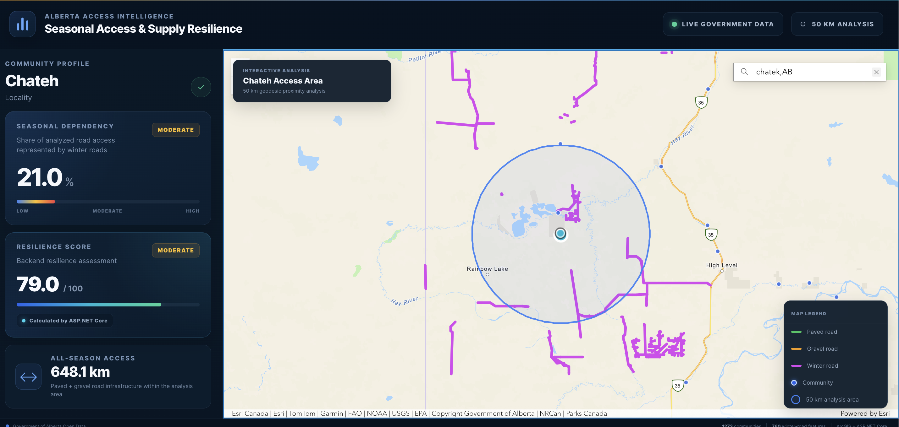

# Alberta Seasonal Access & Supply Resilience

A full-stack GIS decision-support application for analyzing seasonal road access and transportation resilience across Alberta communities.

The application combines interactive geospatial analysis with an ASP.NET Core backend to evaluate how much a community depends on seasonal winter-road infrastructure.

## Application Preview



## Overview

Many Alberta communities, particularly in northern and remote regions, depend on seasonal transportation infrastructure.

This application allows users to select a community and perform a 50 km geodesic proximity analysis of surrounding road infrastructure.

The system analyzes:

- Paved road access
- Gravel road access
- Winter road access
- Winter road segments
- All-season road availability
- Seasonal dependency
- Transportation resilience

The resulting metrics are presented through an interactive GIS dashboard.

## Key Features

- Interactive Alberta community map
- Community selection and spatial analysis
- 50 km geodesic analysis area
- Paved, gravel and winter road visualization
- Layer visibility controls
- Road-distance calculations
- Seasonal dependency calculation
- Transportation resilience scoring
- ASP.NET Core REST API integration
- Responsive decision-support dashboard
- Government of Alberta open-data integration

## Technology Stack

### Frontend

- React
- TypeScript
- Vite
- ArcGIS Maps SDK for JavaScript
- HTML5
- CSS3

### Backend

- C#
- ASP.NET Core
- REST API
- Dependency Injection
- Service-based architecture

### GIS & Data

- ArcGIS Maps SDK for JavaScript
- ArcGIS Feature Services
- Government of Alberta Open Data
- Geodesic spatial analysis

### Development

- Git
- GitHub
- npm
- .NET CLI
- Visual Studio Code

## Architecture

The application follows a full-stack architecture:

```text
Government of Alberta GIS Data
            |
            v
ArcGIS Feature Services
            |
            v
React + TypeScript Frontend
            |
            | Spatial analysis results
            v
ASP.NET Core REST API
            |
            v
Resilience Analysis Service
            |
            v
Seasonal Dependency & Resilience Metrics
            |
            v
Interactive GIS Dashboard